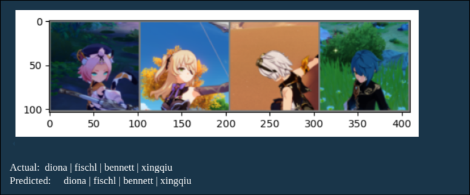

# CNN for Genshin Impact Character Classification

This is Convolutional Neural Network (CNN) architecture designed to classify images of characters from **Genshin Impact**! It draws inspiration from the elegant simplicity of **VGGNet**, integrating deep convolutional layers with modern image augmentation techniques for better generalization.

---

## Architecture Overview

This CNN model follows a VGG-inspired design with these magical components:

- **Convolutional Layers**: Stacked 3x3 convolutions with padding to preserve spatial resolution similar to what VGGNet has implemented. It begins with a `Conv2d` layer transforming the input image with 3 channels (RGB) into 32 feature maps.
- **Activation Functions**: Non-linear ReLU activations are used to introduce non-linearity
- **Pooling Layers**: `MaxPool2d` layers reduce dimensionality while keeping the most important features.
- **Fully Connected Layers**: At the end of the convolutional journey, a few fully connected (dense) layers bring everything together to make the final prediction.

## Data Transformation

To increase the generalization capability of the model. Transformation were used to create slight variations in the image.These transformations are based on techniques used in the VGGNet paper

---

## Training Results

Due to the small size of the dataset, the same training data and testing data were used. This obviously over-represent the testing results - but here it is anyways.

Results below are not indicative of actual accuracy

Accuracy Test Result:
alhaitham  → 100.00%
amber      → 100.00%
barbara    → 100.00%
beidou     → 100.00%
bennett    → 100.00%
collei     → 100.00%
diluc      → 100.00%
diona      → 100.00%
dori       → 100.00%
fischl     → 100.00%
ganyu      → 100.00%
gorou      → 100.00%
jean       → 100.00%
kaeya      → 100.00%
klee       → 100.00%
kujou_sara → 97.37%
kuki_shinobu → 100.00%
layla      → 100.00%
lisa       → 100.00%
lumine     → 100.00%
mona       → 100.00%
nahida     → 100.00%
ningguang  → 100.00%
noelle     → 100.00%
raiden_shogun → 100.00%
razor      → 100.00%
rosaria    → 100.00%
sangonomiya_kokomi → 100.00%
sayu       → 100.00%
shikanoin_heizou → 100.00%
sucrose    → 100.00%
thoma      → 100.00%
xiangling  → 100.00%
xingqiu    → 100.00%
xinyan     → 100.00%
yaoyao     → 100.00%
yoimiya    → 100.00%
yun_jin    → 100.00%
Overall Accuracy: 99.93%

---

## Further Improvements

This project is more of a curiosity project. It can be further improved with a larger dataset and better hyperparameters. 

---

# Credits

honchokomodo - genshin impact heads: https://www.kaggle.com/datasets/honchokomodo/genshin-impact-heads
Karen Simonyan & Andrew Zisserman - Very Deep Convolutional Networks for Large-Scale Image Recognition: https://arxiv.org/pdf/1409.1556

